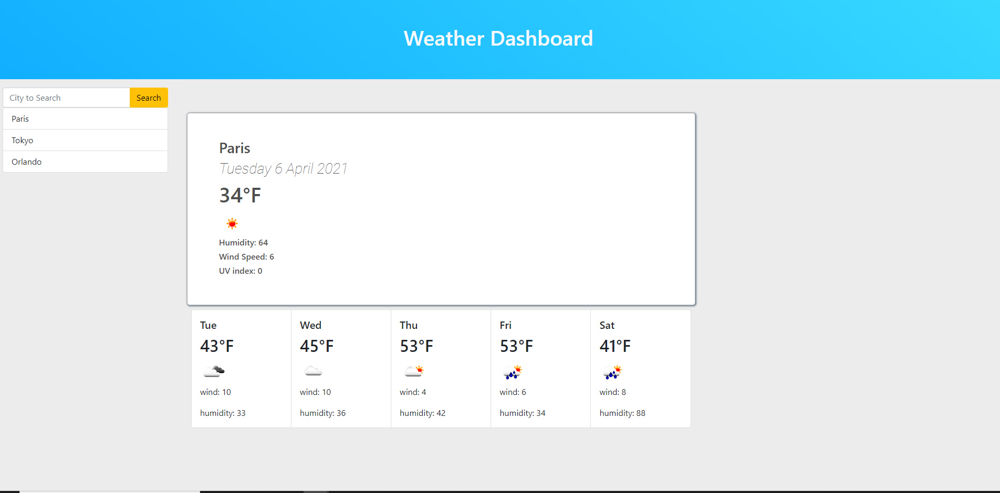

# My Weather.JS

## Overview
This Weather Dashboard was written in JS using a server API from Open Weather, it will gather data from cities and display it's local weather information ex. wind speed & humidity. It will also show a 5 day overall forecast.
Users can check weather from many cities around the world and it's will be saved into local storage.

## how to use it.
Just type the name of the city you would like to check the weather and press search.
the website will save your choice so everytime you open the page the last item searched will be displayed to you.

